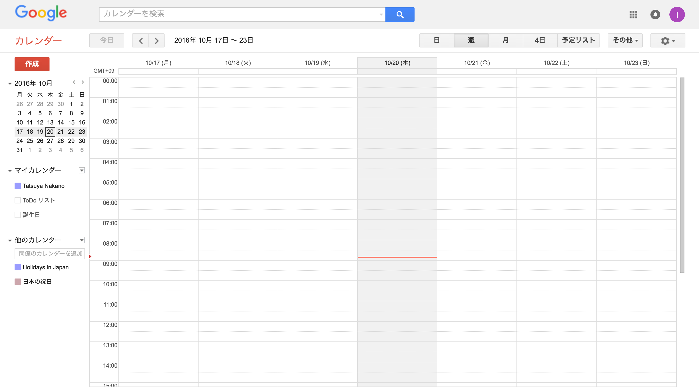
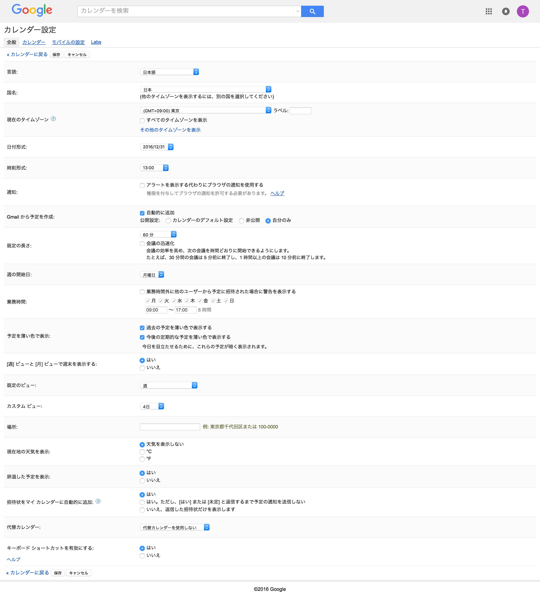

# Settings（カレンダーの設定）

## 概要
Googleカレンダーの全般的な設定をAPIで **取得** できます。
取得だけで設定はできません。

### 公式リファレンス
https://developers.google.com/google-apps/calendar/v3/reference/settings

## カレンダーの設定画面の表示方法

#### 設定ボタンを押下

#### 設定画面を表示

## 対応表
APIで取得できる項目と画面に表示されている項目の対応表を載せておきます。

todo:画像

## get

## list

[import, list-response.json](./src/list-response.json)

## watch

