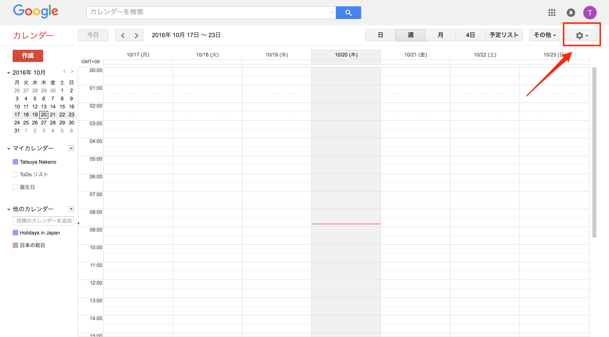
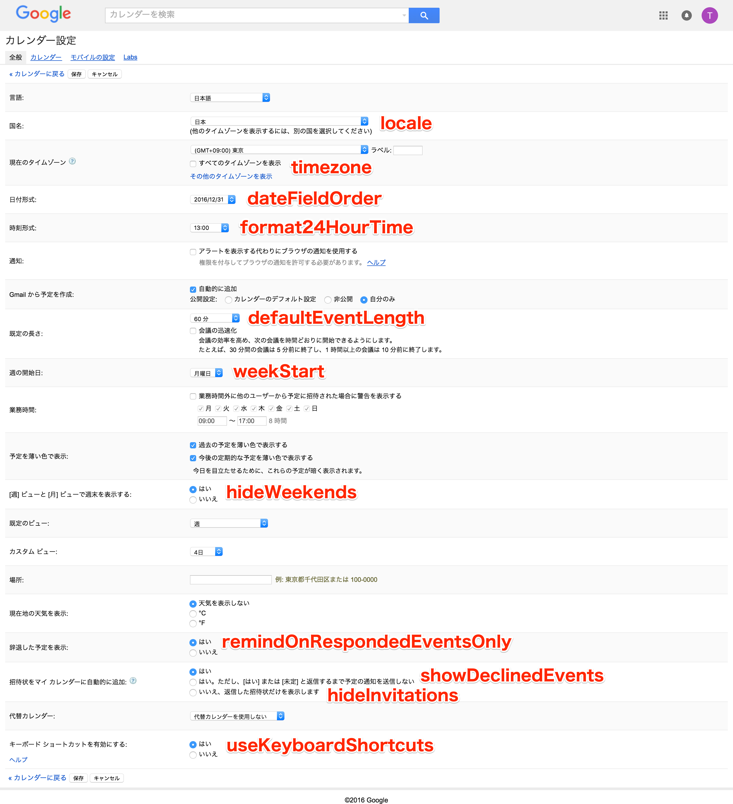

# Settings（カレンダーの設定）

## 概要
Googleカレンダーの全般的な設定の**取得**ができます。**設定はできません。**

### 公式リファレンス
https://developers.google.com/google-apps/calendar/v3/reference/settings

## カレンダーの設定画面の表示方法

### 設定ボタンを押下

### 設定画面が表示されます

## 画面とAPIの関係

### 対応図
APIで取得できる項目と画面に表示されている項目の対応図を載せておきます。

### 項目の補足
**hideInvitations**と**remindOnRespondedEventsOnly**ですが、画面上同じ項目に含まれてるため分かりづらいため補足しておきます。

|招待状をマイ カレンダーに自動的に追加|remindOnRespondedEventsOnly|hideInvitations|
|:-----------|:------------:|:------------:|
|はい|false|false|
|はい。ただし、[はい] または [未定] と返信するまで予定の通知を送信しない|true|false|
|いいえ、返信した招待状だけを表示します|false|true|

## list
list API発行時のレスポンスを載せておきます。
[import, list-response.json](./src/list-response.json)
